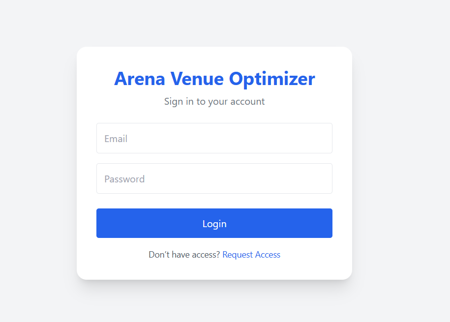
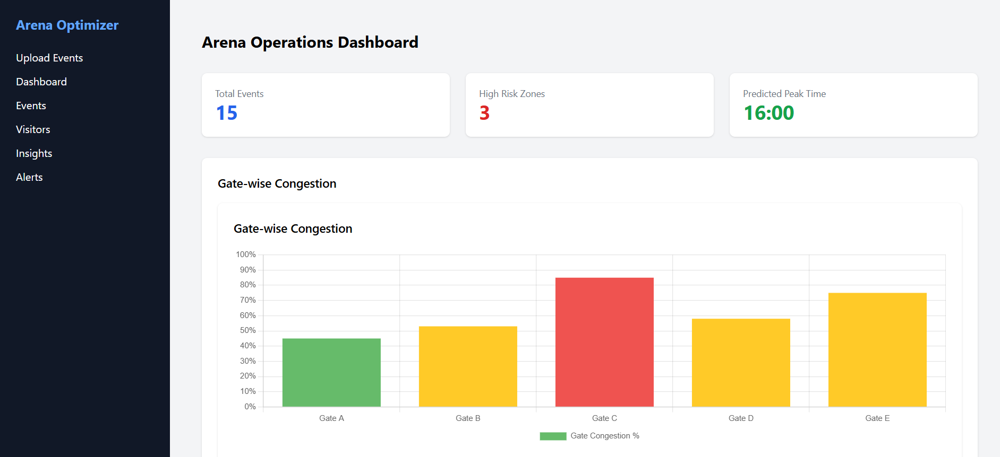
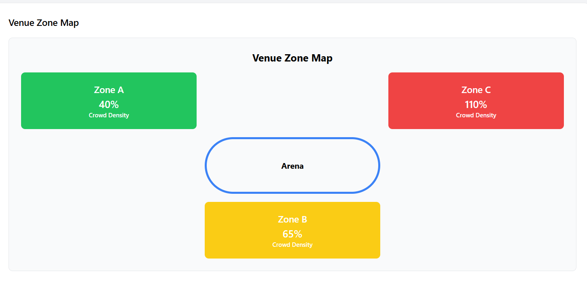
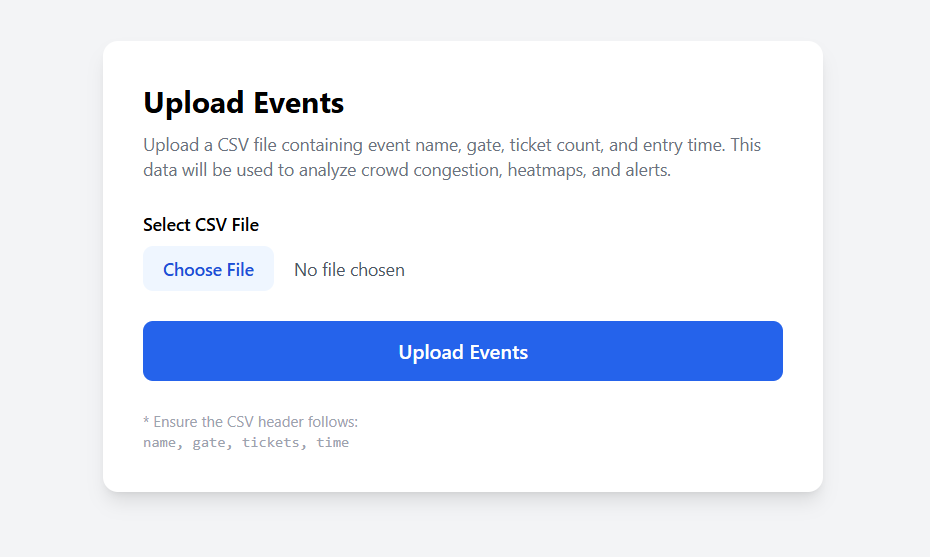
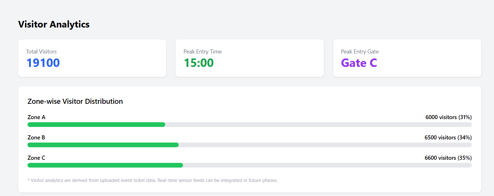
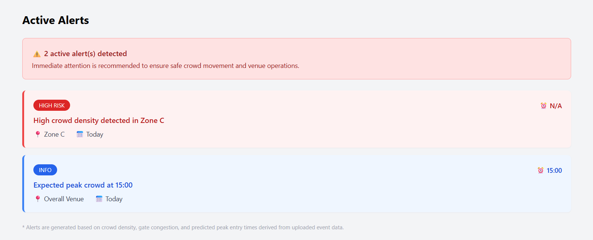

# Arena Venue Optimizer

Arena Venue Optimizer is a full stack web application that analyzes uploaded event ticket data to generate operational insights such as gate congestion levels, zone density heatmaps, peak crowd time prediction, and safety alerts.

The system helps venue managers monitor crowd flow and identify high risk zones during large events.

------------------------------------------------------------

## Project Objective

To build a data driven venue monitoring system that:

- Accepts internal event ticket CSV data
- Detects peak entry time
- Calculates gate wise congestion
- Calculates zone wise crowd density
- Identifies high risk zones
- Generates alerts
- Displays analytics in a live dashboard

------------------------------------------------------------

## Tech Stack

Frontend:
- React
- Tailwind CSS
- Axios

Backend:
- Node.js
- Express.js
- Multer for CSV upload
- Custom analysis service

Deployment:
- Render

------------------------------------------------------------

## Project Workflow

1. Upload event CSV file
2. Generate analytics insights
3. Fetch dashboard data
4. Display congestion, heatmap, alerts, and visitor analytics

------------------------------------------------------------

## CSV Format

Required Columns:

eventName,gate,tickets,time

Example:

Mega Fest,Gate A,4000,15:00
Mega Fest,Gate B,9000,15:00
Mega Fest,Gate C,9000,15:00

------------------------------------------------------------

## Core Analytics Logic

1. Peak Time Detection
The hour with the highest total ticket count is identified as peak time.

2. Gate Congestion Percentage
(tickets at peak hour / gate capacity) × 100

3. Zone Density Percentage
(zone traffic at peak hour / zone capacity) × 100

4. High Risk Zone Detection
Zone density >= configured threshold

------------------------------------------------------------

## Dashboard Metrics

The dashboard displays:

- Total Events
- Peak Time
- High Risk Zones Count
- Gate Congestion Percentages
- Zone Heatmap Percentages
- Alerts
- Visitor Distribution

------------------------------------------------------------

## API Endpoints

POST /api/events/upload  
Upload event CSV

POST /api/insights/generate  
Generate analytics insights

GET /api/dashboard  
Fetch complete dashboard analytics

GET /api/insights  
Fetch summary insights

GET /api/alerts  
Fetch active alerts

GET /api/visitors  
Fetch visitor analytics

------------------------------------------------------------

## Running Locally

Backend:

npm install
npm start

Frontend:

npm install
npm run dev

Default Backend Port:
4000

------------------------------------------------------------

## Example Expected Output

Peak Time: 15:00  
High Risk Zones: 1  

Gate Congestion:
Gate A: 20%
Gate B: 60%
Gate C: 90%

Zone Heatmap:
Zone A: 27%
Zone B: 75%
Zone C: 112%

Alerts:
High congestion expected at Gate C
High crowd density in Zone C

------------------------------------------------------------

## Future Enhancements

- Replace in memory storage with database
- Add real time monitoring
- Add predictive analytics integration
- Add historical trend tracking

------------------------------------------------------------

## Application Screenshots

### Login Page

### Dashboard

### Venue Zone Map

### Event Upload

### Visitor Analytics

### Insights

### Alerts
